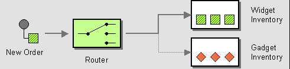
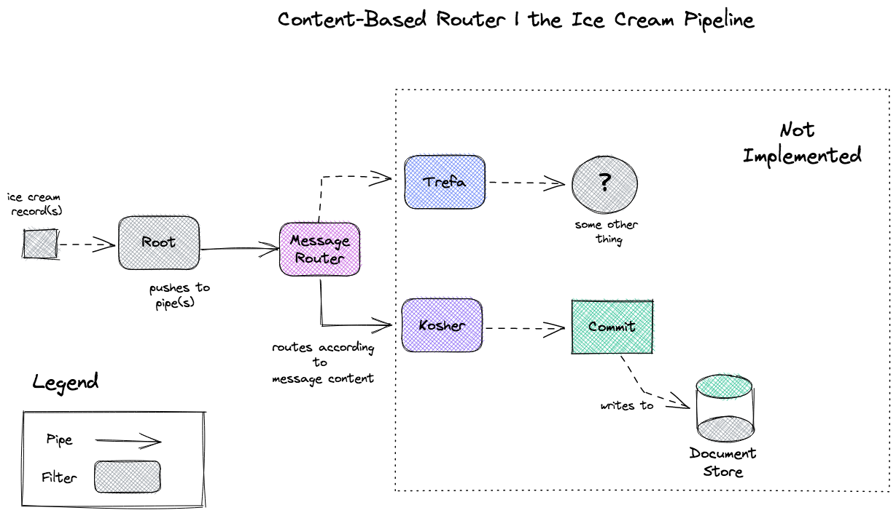

# eip-content-based-router
An exploration of the Content-Based Router pattern from Enterprise Integration Patterns (https://tinyurl.com/ye2tuub2)
## Introduction

The Pipes and Filters pattern answers the following design prompt:
> How do we handle a situation where the implementation of a single logical function (e.g., inventory check) is spread across multiple physical systems?

The answer is embodied in this architecture: 

> "...Use a Content-Based Router to route each message to the correct recipient based on message content." - Enterpise Integration Patterns

## Pattern Summary
The Content-Based Router examines the message content and routes the message onto a different channel based on data contained in the message. The routing can be based on a number of criteria such as existence of fields, specific field values etc. 

## Implementation Summary
In this exercise we process a list of records containing metadata about different flavors of ice cream and process the records with a Content-Based Router. The router inspects the incoming messages and identifies which messages contain information about whether a specific ice cream is kosher before forward messages to an appropriate filter. Messages (i.e. ice cream records) that are kosher routed to a kosher-specific filter and non-kosher messages are routed to a filter that consumes non-kosher messages only.

In this example, the implementation of the Kosher and non-Kosher filters and and downstream processing logic associated with them are left as an exercise for the reader. 

The key insight from this pattern is that new processing logic can be brought online seamlessly to expand the processing capabilities of the pipeline without disturbing existing filters. However, implementers of this pattern must take caution to ensure that an unmanageable amount of routing logic does not end up in the message router component such that a bottleneck is created in the flow. Per *Enterprise Integration Patterns*:

> "When implementing a Content-Based Router, special caution should be taken to make the routing function easy to maintain as the router can become a point of frequent maintenance. In more sophisticated integration scenarios, the Content-Based Router can take on the form of a configurable rules engine that computes the destination channel based on a set of configurable rules."

